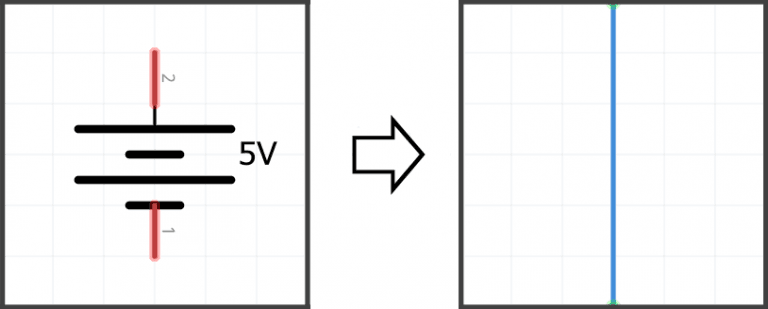
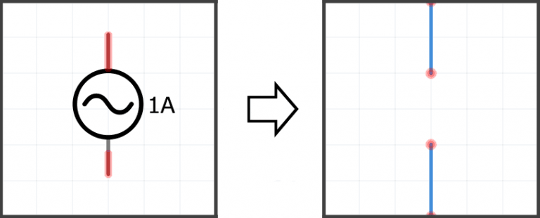

# INFORME4

## **TEOREMA DE SUPERPOSICIÓN** 
1. OBJETIVOS
* 1.1 OBJETIVO GENERAL

 Demostrar el Teorema de Superposicíon teóricamente y prácticamente por medio de simuladores digitales con el fin de comparar ambos resultados e identificar la eficacioa de este método utilizado en el análisis de circuitos eléctricos que cuentan con varias fuentes.

* 1.2 OBJETIVOS ESPECÍFICOS

- Hallar los valores del circuito por medio de cálculos.
- Analizar circuitos mediante el método de superposición.
- Simular el circuito digitalmente
- Comparar los resultados simulados y los obtenidos analíticamente.

2. REQUISITOS PREVIOS
Se requiere el análisis analítico del circuito mostrado en la figura 4.1., aplicando el
Teorema de Superposición. Obtenga los valores de VA e IX, respetando tanto la polaridad
del voltaje como el sentido de la corriente que se proporcionan y anote los resultados en
la tabla 4.1. y 4.2. según corresponda.

3. INFORMACIÓN GENERAL

 Uno de los métodos que se aplica en el análisis de circuitos eléctricos que cuentan
con varias fuentes, es el Teorema de Superposición que establece que:

***El voltaje o corriente a través de cualquier elemento del circuito puede obtenerse
sumando algebraicamente todos los voltajes o corrientes individuales generados por
cada fuente actuando por sí sola, con todas las demás fuentes igualadas a cero.***

**Las fuentes de voltaje igualadas a cero equivalen a un corto circuito**

**Las fuentes de corriente igualadas a cero equivalen a un circuito abierto**

* **PASOS**

1) ***Identificar las Fuentes independientes***

Primero hay que identificar todas las fuentes independientes del circuito

2) ***Escoge una fuente y “apaga” las demás***

Cada que escojas una fuente para analizar deberás “apagar” todas las demás. Las fuentes de corriente se abren y fuentes de voltaje se cortocircuitan, menos la fuente que estará considerando en los próximos pasos.

3) ***Calcula el voltaje y la corriente***

Encuentra la corriente en cada rama y el voltaje en cada nodo, se puede usar cualquier método.

4) ***Repita los dos pasos anteriores para cada fuente independiente***

Se repide tomando en cuenta el número de fuentes independientes del circuito

5) ***Realiza la sumatoria***

Finalmente,se encuentra la suma algebraica de cada corriente de rama y voltaje de nodo de las corrientes y voltajes individuales anteriores

4. MATERIAL Y EQUIPO

* 4.1 TABLA

| Cantidad  | Elemento  | 
| --------- | --------- | 
| 2 | Fuente de Voltaje de C.D |
| 2 |	Multímetros Digitales |
| 1 |	Resistor de 1 KΩ |
| 1 | 	Resistor de 2.2 kΩ |
| 1 | 	Resistor de 820 Ω |
| 1 |	Resistor de 470 Ω |
| 1 |	Protoboard |

* 4.2 CIRCUITO

5.   PROCEDIMIENTO

* **5.1 Arme el circuito que se presenta en la figura 4.1.**

* **5.2 Con las dos fuentes conectadas, mida el voltaje VA y la corriente Ix, respetando la polaridad del voltaje como el sentido de la corriente que se proporcionan. Anote el valor de las mediciones en la tabla 4.1 y 4.2 respectivamente.**

* **5.3 Haga "cero" la fuente de voltaje de 12 V (V2) y mida el voltaje VA y la corriente Ix, respetando la polaridad del voltaje como el sentido de la corriente que se proporcionan. Anote el valor de las mediciones en la tabla 4.1 y 4.2 respectivamente.**

* **5.4 Haga "cero" la fuente de voltaje de 20 V (V1) y mida el voltaje VA y la corriente Ix, respetando la polaridad del voltaje como el sentido de la corriente que se proporcionan. Anote el valor de las mediciones en la tabla 4.1 y 4.2 respectivamente.**

* **5.5 Verifique el cumplimiento del Teorema de Superposición y compare los resultados obtenidos prácticamente con los obtenidos analíticamente. Realice sus conclusiones.**

Solución del circuito con el método de superposición en el voltaje de 12 V

Solución del circuito con el método de superposición en el voltaje de 20 V

Tabla 4.1: Medición de voltaje aplicando superposición

Tabla 4.2: Medición de corriente aplicando superposición

6. VIDEO

https://youtu.be/Su5SQCv56ak

7. CONCLUSIONES

* Los valores obtenidos analpiticamente tanto de los voltajes como de las corrientes eran similares a los obtenidos en la simulación, sin embargo, observamos que estos datos tuvieron unos pequeños márgenes de error. 
* El uso y aplicación del teorema de superposición es de gran efectividad cuando hallamos más de dos fuentes de voltaje (o corriente) presentes en nuestro circuito electróncico y queremos calcular la intensidad que fluye en algun elemento en especifico.

8. BIBLIOGRAFÍA

* Bobinando, (2020) [Video] *Recuperado de:* https://www.youtube.com/watch?v=AsjT9jO8new&feature=youtu.be
* Alulema D., (2021) "Guias Segundo Pacial" *Recuperado de:* https://drive.google.com/file/d/1z279bqKwrITuVkpiTGvmhvx0uP6dU0IK/view
* MiElectrónicaFácil "Teorema de Superposición" *Recuperado de:* https://mielectronicafacil.com/analisis-de-circuitos/teorema-de-superposicion/#pasos-a-seguir
